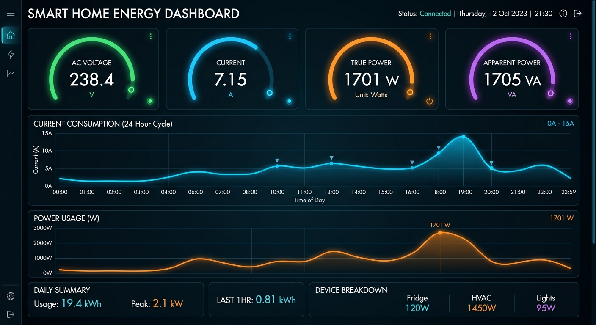
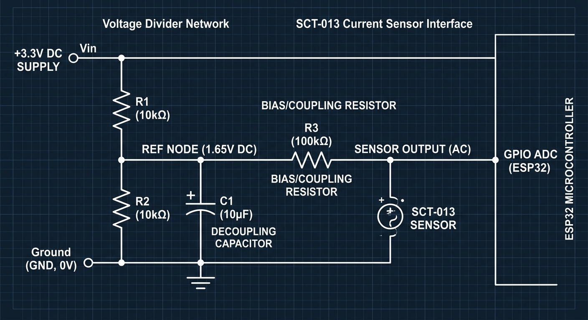

# Smart Home Energy Monitoring System

[](#)
[](#)
[](#)

An industry-oriented, modular, end-to-end IoT edge platform designed to measure and monitor individual and aggregate residential circuits safely. Features continuous high-frequency digital signal processing (DSP) wave calculations on an ESP32 microcontroller, non-volatile backup storage, lightweight real-time telemetry streaming over JSON-MQTT, and tight integration with Home Assistant/Grafana dashboard pipelines.

This repository structure is designed to serve as an academic submission portfolio, containing actual hardware firmwares, local interactive simulation rigs, electrical diagrams, and formal submission paperwork.

---

## 📌 Unified Monitoring Dashboard Preview

The system resolves residential energy opacity by monitoring real-time electrical parameters (Vrms, Irms, Apparent Power, Active Power, Power Factor, and cumulative energy consumption) per circuit.

Here is the visual mockup of our unified monitoring dashboard reporting real-time load analytics:



---

## 📁 Repository Directory Structure & Explanations

This repository is strictly partitioned into functional subdirectories to enforce enterprise boundaries, decoupling active physical firmware from virtual simulations, database captures, and academic submissions.

### The Project Structure Directory Tree:
```
Smart-Home-Energy-Monitoring-System/
├── arduino_code/
│   └── esp32_energy_meter.ino       # C++ ESP32 firmware with burst sampling & MQTT
├── python_simulation/
│   └── energy_simulation_station.py # Python virtual testing environmental model
├── dashboard/
│   └── home_assistant_sensors.yaml  # Lovelace dashboard entities and MQTT listeners
├── data/
│   └── simulated_energy_history.csv # Persistent database file recording live telemetry
├── outputs/
│   └── placeholder.txt              # Destination output path for analytical plots and logs
├── images/
│   ├── dashboard_analytics.png      # High-fidelity dashboard visualization markup
│   └── circuit_schematic.png        # Hardware biasing AFE circuit diagram
├── circuit_diagram/
│   └── biasing_circuit_design.txt   # Electrical conditioning specs & design formulas
├── reports/
│   └── academic_submission_report.md# Formal senior design or laboratory project submission
└── docs/
    └── wiring_schematics.md         # Full assembly manual and step-by-step soldering guidelines
```

### Folder Explanations in Detail:
1. **`arduino_code/`**  
   Contains the ready-to-flash C++ firmware for the physical ESP32 MCU. It handles 4kHz burst waveform sampling, subtraction of DC bias offsets in real-time, calculates True RMS current, handles safety latch-open relays, and manages WiFi/MQTT reconnection loops.
2. **`python_simulation/`**  
   Contains the virtual environmental simulation script. It models multiple active home appliance profiles (Baseload, Aircon, Space Heater, Washing Machine, and Smart TV) with randomized wave phase noises, logging outcomes cleanly into persistent tables.
3. **`dashboard/`**  
   Defines native declaration YAML assets representing entity mappings and automation alert rules to pipe live MQTT streams directly into Home Assistant's Lovelace dashboards.
4. **`data/`**  
   Includes the persistent database CSV storage tracking the timestamped logs of voltage, current, apparent/true power, power factors, Wh metrics, and alarm trip states.
5. **`outputs/`**  
   The reserved output directory for holding any dynamically updated plots, figures, or summary reports created during simulations or testing operations.
6. **`images/`**  
   Houses visual portfolio imagery (dashboard mocks, schematic charts) providing gorgeous graphical context in our repository markdown displays.
7. **`circuit_diagram/`**  
   Features analog biasing descriptions detailing resistive divider designs, capacitor couplings, safety components, and physical pin maps.
8. **`reports/`**  
   Contains formal, course-compliant academic submission documentation summarizing experimental test logs, discrete equations, and project outcomes.
9. **`docs/`**  
   Step-by-step guides detailing physical assembly, component bill of materials (BOM), solder rules, and high-voltage circuit clamp safety protocols.
10. **`requirements.txt`**  
    Declares required Python framework packages (Pandas, Matplotlib, Paho-MQTT, Numpy) used to execute local simulation stations.
11. **`main.py`**  
    A root-level Python runner that immediately initializes the virtual simulation terminal panel without navigating subfolders.

---

## 🛠️ Hardware Setup & Biasing Circuit

### The Analog Conditioning Challenge
Alternating currents generate alternating waves swinging negative and positive (e.g. ±1V Peak). Micro-controllers like the ESP32 possess single-ended Analog-to-Digital Converters (ADCs) that only read relative positive voltages between **0V and 3.3V**. Receptacle negative currents fed directly would clip out, corrupt mathematical RMS evaluations, and physically degrade microcontroller silicon over time.

To resolve this, we construct a **1.65V DC Bias Node** using a resistor divider with electrolytic decoupling capacitors. The AC current signal is safely centered around this offset, swinging safely between **0.65V and 2.65V**.

Here is our complete biasing circuit diagram:



*To view the detailed hardware bill-of-materials and step-by-step assembly guides, refer to [`docs/wiring_schematics.md`](Smart-Home-Energy-Monitoring-System/docs/wiring_schematics.md).*

---

## 📐 Mathematical Digital Signal Processing Implementations

### Root-Mean-Square (RMS) Current $I_{RMS}$
For high-frequency AC waves, we approximate continuous temporal RMS integrals inside our discrete MCU sampling loop:
$$I_{RMS} \approx K_{cal} \times \sqrt{\frac{1}{N} \sum_{n=1}^{N} \left( V_{adc}[n] - V_{bias} \right)^2}$$
Where:
- $N$ represents the sample dataset count ($N = 2000$).
- $V_{adc}[n]$ is the raw discrete volt captured.
- $V_{bias}$ is the DC offset scalar ($1.65\text{V}$, dynamically adjusted).
- $K_{cal}$ is our combined current-burden calibration coefficient.

### Power Integrations & Billing
- **Apparent Power ($S$):**  
  $$S = V_{RMS} \times I_{RMS} \quad \text{(Volt-Amps)}$$
- **True Active Power ($P$):**  
  $$P \approx \frac{1}{N} \sum_{n=1}^{N} v[n] \cdot i[n] \quad \text{(Watts)}$$
- **Power Factor ($PF$):**  
  $$PF = \frac{P}{S}$$

---

## 🚀 Quick Start Guide

### 1. Running the Local Simulation Station
You can immediately simulate environmental telemetry streams locally on your desktop.
1. Install Python 3.x.
2. Clone the repository and install dependencies from the folder directory's root:
   ```bash
   pip install -r Smart-Home-Energy-Monitoring-System/requirements.txt
   ```
3. Run the host-level entry runner:
   ```bash
   python Smart-Home-Energy-Monitoring-System/main.py
   ```
4. Observe real-time CLI updates, cycle loads, and inspect historical CSV streams appended straight inside `./Smart-Home-Energy-Monitoring-System/data/simulated_energy_history.csv`.

### 2. Physical ESP32 Node Deployment
1. Connect components according to [`wiring_schematics.md`](Smart-Home-Energy-Monitoring-System/docs/wiring_schematics.md).
2. Open [`arduino_code/esp32_energy_meter.ino`](Smart-Home-Energy-Monitoring-System/arduino_code/esp32_energy_meter.ino) inside the Arduino IDE.
3. Configure your local WiFi `SSID`, `WIFI_PASSWORD`, and broker IP addresses in the top configuration header.
4. Set board config to "ESP32 Dev Module" and flash the compiled binary over a serial USB line.
5. Inspect serial monitors running at `115200` baud.
